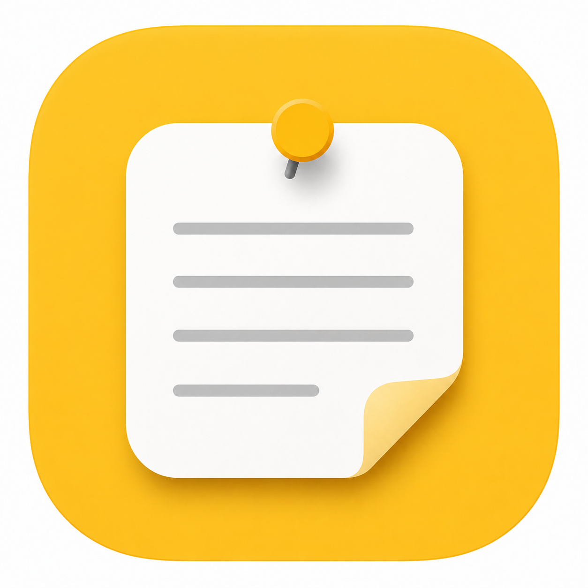
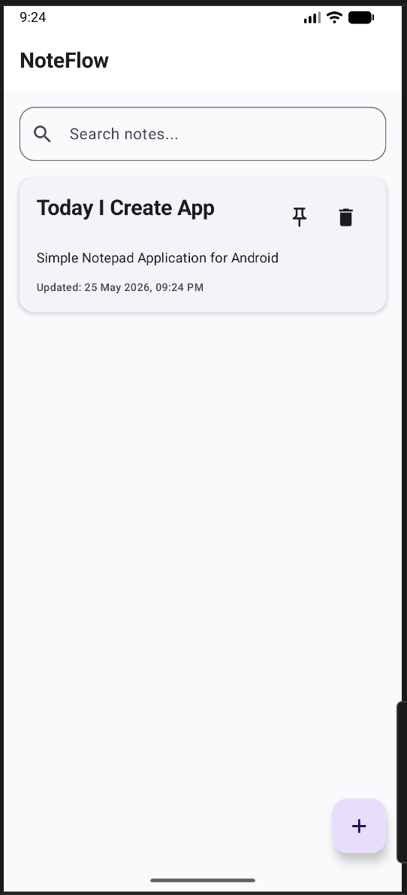
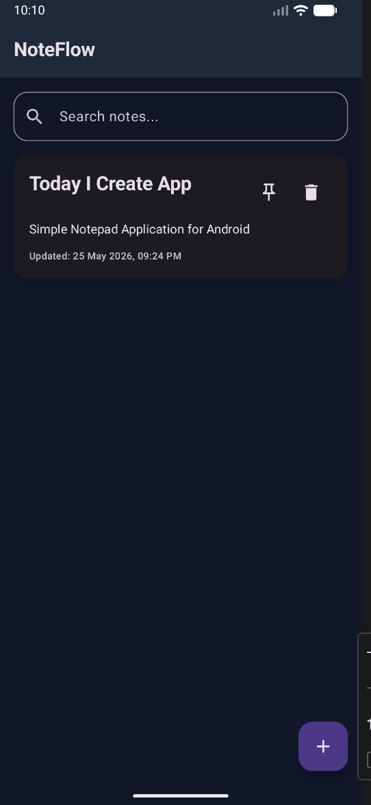
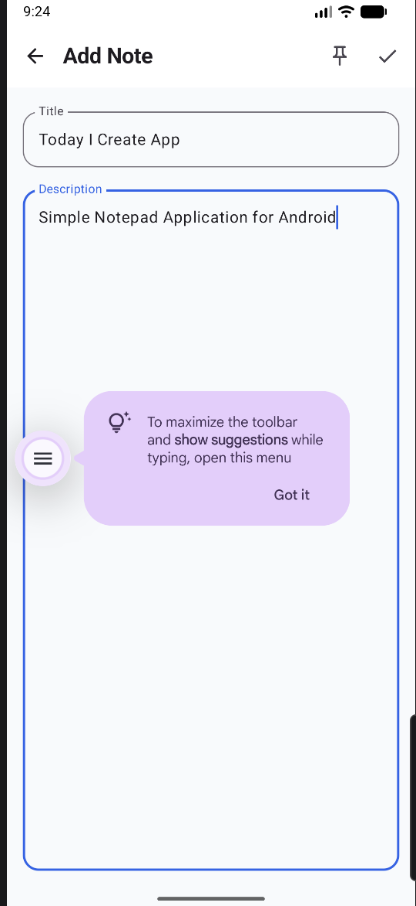

  

<h1 align="center">NoteFlow 📝</h1>

Modern offline-first Android Notes App built with Kotlin and Jetpack Compose.

---

## Features

- Add, edit, and delete notes
- Title and description fields
- Search notes
- Pin important notes
- Created and updated dates
- Empty state screen
- Delete confirmation dialog
- Room local database
- Light and dark mode support
- Modern Material 3 UI

---

## Improvements

- Clean MVVM architecture
- Repository pattern implementation
- StateFlow state management
- Responsive modern UI
- Offline-first database support
- Smooth navigation between screens
- Optimized Compose UI structure
- Beginner-friendly clean code

---

## Run Instructions

1. Open Android Studio.
2. Choose **File > Open** and select the `NoteFlow` folder.
3. Let Gradle sync finish.
4. Select an emulator or real Android device.
5. Click **Run**.

---

## Package Structure

- `model` - Room entity
- `data/local` - DAO and database
- `data/repository` - repository layer
- `di` - simple dependency provider
- `viewmodel` - StateFlow and app logic
- `ui/screens` - home and edit screens
- `ui/components` - reusable UI components
- `ui/navigation` - Navigation Compose routes
- `ui/theme` - Material 3 colors and theme

---

## Important: Fix Java/JDK Error

If Android Studio says it cannot find Java 17, open:

Preferences/Settings → Build, Execution, Deployment → Build Tools → Gradle

Set Gradle JDK to JDK 21.

Then:
- Sync Project
- Clean Project
- Rebuild Project

---

## App Icon

The NoteFlow launcher icon is already added in:
- All mipmap folders
- Adaptive icon format
- AndroidManifest.xml

---

## JDK 21 Fixed Version

This project is configured for Java/JDK 21.

### Android Studio Setup

1. Install JDK 21 if not already installed.
2. Open Android Studio.
3. Go to Settings/Preferences → Build, Execution, Deployment → Build Tools → Gradle
4. Set Gradle JDK → JDK 21
5. Click File → Sync Project with Gradle Files
6. Build project again.

### Important

Do not use:
- JDK 25
- JDK 26

Recommended:
- JDK 21

---

## Future Improvements

- Cloud synchronization
- Biometric authentication
- Categories and labels
- Reminder notifications
- Backup & restore
- Markdown support
- Rich text editor
- Multi-device sync

---

## Screenshots

### Home Screen

### Dark Mode

### Add Note

### Search Notes

---

## Contributing

Contributions are welcome and appreciated.

If you would like to improve NoteFlow:

1. Fork the repository
2. Create a new feature branch
3. Commit your changes
4. Push to your fork
5. Open a Pull Request

Please ensure:
- Clean and readable code
- Proper naming conventions
- No compile errors
- Consistent Material 3 UI design

---

## License

This project is licensed under the MIT License.

---

Made with ❤️ using Kotlin & Jetpack Compose

